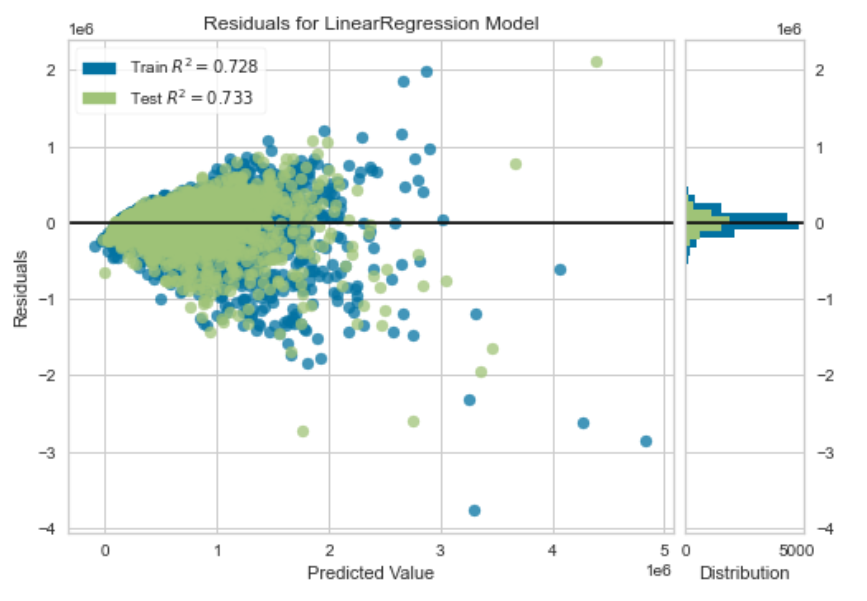

# Phase Two Project Repo

# King County, Washington: Data Analysis & Strategy Recommendations

**Authors**: Pete VanZandt, Emma Choate, Alex Valencia

## Overview

For this project, we used linear regression to model housing sales in King County, a northwestern county in Washington state that includes Seattle.

## Business Problem

A Seattle real estate firm wants their clients to have a prediction for the sale price of their home based on the information of their home. In order to achieve this, they would like a tool that can be as accurate as possible in their predictions. We have come in to create this tool and use it for this real estate firm’s clients.

## Data

We used data from kc_house_data.csv and column_names.md. This data is based on the numbers between the years 2014 - 2015 and contains the following information:

* **id** - unique ID for a house
* **date** - date house was sold
* **price** -  price house was sold; is prediction target
* **bedrooms** -  number of bedrooms
* **bathrooms** -  number of bathrooms
* **sqft_living** -  square footage of the home
* **sqft_lot** -  square footage of the lot
* **floors** -  floors (levels) in house
* **waterfront** - house does or does not have a waterfront
* **view** - how good the property view is
* **condition** - how good the condition is (1 - 5)
* **grade** - overall grade given to the housing unit building construction and design, based on King County grading system
* **sqft_above** - square footage of house apart from basement
* **sqft_basement** - square footage of the basement
* **yr_built** - year when house was built
* **yr_renovated** - year when house was renovated
* **zipcode** - zipcode area of the house
* **lat** - latitude
* **long** - longitude
* **sqft_living15** - square footage of interior housing living space for the nearest 15 neighbors
* **sqft_lot15** - square footage of the land lots of the nearest 15 neighbors

We also used King_co_zipcodes.csv to OneHotEncode the zipcodes saved as municipalities. The source of the data came from King County Open Data - https://data.kingcounty.gov/.

### Process
We screened the data and looked at the range of total prices to find any patterns. We didn't drop any outliers besides one house that had 33 bedrooms, suggesting a data entry error. We identified preliminary modeling features were the most promising by creating correlation plots. We then built a baseline model with the one predictor whose correlation was strongest with price: sqft_living.

We then used an iterative process to create more models and come up with the best predictability on house prices across all house price ranges.

## Methods & Results

First, we pulled the original dataframe and created three separate functions: a function that would run a multiple regression model, a function to plot residuals from the model, and a function that plots model error across a range of prices. The error plotting function cuts the dataframe into 10 bins of house prices, shows us how much error there is in predicting house prices in each bin, and shows us the standard deviation of each bin.

Next, we built our first model using sqft_living as our main predictor because its pairwise correlation was strongest with price. Our train error (RMSE) was around 262419, our test error was around 259878, and our R-square was around 0.488 -- this told us that sqft_living didn't account for as much variance as we had originally expected, and there were plenty of other predictors we needed to include in our model. Our residual plots showed us that the data were highly variable with increasing price and that there were many outliers in the data. Our error plots indicated that the errors for a few bins were high, especially for houses in the top 10% price range. This is our baseline model and you will find our residual plot for the baseline below:


We continued modifying and iterating our model by adding a new feature called **area_basement** which was created by subtracting the difference between sqft_living and sqft_above. We added this new feature to 12 other numerical features for this model that included bedrooms, bathrooms, sqft_living, sqft_lot, floors, condition, grade, sqft_above, yr_built, zipcode, sqft_living15, and sqft_lot15. These features were chosen based on initial pairwise correlations, as well as our intuition for factors that would be important for house prices. Our train error (RMSE) was around 226809, our test error was around 225347, and our R-square was around 0.618 -- our model showed significant improvement compared to the first model based on these results.

We scaled the predictors with our third model using RobustScaler(), we changed our target variable from **price** to **log_price** with our fourth model, and we used fewer features with our fifth model. Unfortunately, none of theses changes brought significant improvement to our model. 

On our sixth model, we added three interaction features:
 - **living_grade** (sqft_living * grade)
 - **grade_bath** (grade * bathrooms)
 - **living_bath** (sqft_living * bathrooms)

These three interactions were added because they had the strongest combined impact on the price of the home.

We saw significant improvement in this model because our train error (RMSE) decreased to 187242, our test error decreased to 188290, and our R-square increased to 0.739. Our residual model showed us less outliers than the first model. Our error plot showed us lower average error in all 10 bins -- 9 out of 10 bins contained errors that were less than $50,000. We included 20 features to get this output - bedrooms, bathrooms, sqft_living, sqft_lot, floors,
condition, grade, sqft_above, yr_built, zipcode, sqft_living15, sqft_lot15, area_basement, grade * bath, living * grade, living * bath, lat, waterfront, long, and view. All variables were treated as continuous predictors.

Our best fit model came from our seventh model, which was a polynomial model. We dropped the features id, date, and yr_renovated. We saw even more significant improvement in this model because our train error (RMSE) decreased to 147269, our test error decreased to 165436, and our R-square increased to 0.798. Our residual model slightly reduced our outliers compared to our sixth model. Our bin-error model showed us even less errors in all 10 bins -- 9 out of 10 bins contained errors that were less than $20,000. Houses in the top bin  - the top 10% price range - had around $100,000 error which was the smallest error this bin received on all our models. The higher test error suggested substantial overfitting, which makes sense because the model had 253 features.

In addition, we made a second polynomial model - our eighth model - dropping nine extreme residuals. We did this because there were nine houses that had a stark difference between the selling price and the predicted price. For example, one of the residuals contained a house with a selling price of $2.3 million and a predictive value of $6 million. After dropping these outliers, we saw our train error (RMSE) drop to 144894, our test error drop to 155990, and our R-square increased to 0.823. Our residual model and our bin-error model stayed constant to the previous polynomial model. We chose not to make this our best fit model because we don't have any real justification for dropping these extreme residuals.

For our ninth model, we used data from the King_co_zipcodes.csv file and attempted to OneHotEncode the zipcodes by municipality. Unfortunately, this made our model worse by increasing the train model (RMSE) to 188339, increasing the test model to 190695, and lowering the R-square to 0.736. Therefore, we did not adopt the municipality data to our best fit model, and we continued to treat zip codes as a continuous variable.

On the final model, we removed the poorest predictors and simplified our model. We kept 13 features - bedrooms, bathrooms, sqft_living, floors, condition, grade, yr_built, zipcode, grade * bath, lat, waterfront, long, and view - and received a train error (RMSE) around 191327, a test error around 190102, and an R-square around 0.728. Our residual model did not change and our bin-error model showed us our errors for 9 out of 10 bins were less than $50,000. This is the model we suggest the Seattle real estate firm uses to predict housing prices, as it strikes a balance between predictive power and interpretability. The residual plots for our recommended model are shown below. For better predictive power, the most complex polynomial model would be recommended. 



## Conclusions

- We were able to create a model to predict the selling price of a home across a wide range of prices and conditions
- Our model could be used on recent data to help the real estate company provide their customers with helpful insights to predict the selling price of their home based on its features
- Breaking down homes into price ranges, using nonlinear modeling, and tracking home data trends over time may produce more reliable predictions

## For More Information

Please review our full analysis in [our Jupyter Notebook](./notebooks/exploratory/pete/Emma_Alex_Pete_house_analysis.ipynb) or our [presentation](./Microsoft_Movie_Analysis_Presentation.pdf)

For any additional questions, please contact **Pete VanZandt - pevanzandt@gmail.com, Emma Choate - emmachoate11@gmail.com, Alex Valencia - asvalencia1688@gmail.com**

## Repository Structure

Describe the structure of your repository and its contents, for example:

```
├── README.md                           <- The top-level README for reviewers of this project
├── microsoft_movie_analysis_final.ipynb   <- Narrative documentation of analysis in Jupyter notebook
├── Microsoft_Movie_Analysis_Presentation.pdf         <- PDF version of project presentation
├── data                                <- Both sourced externally and generated from code
└── images                              <- Both sourced externally and generated from code

